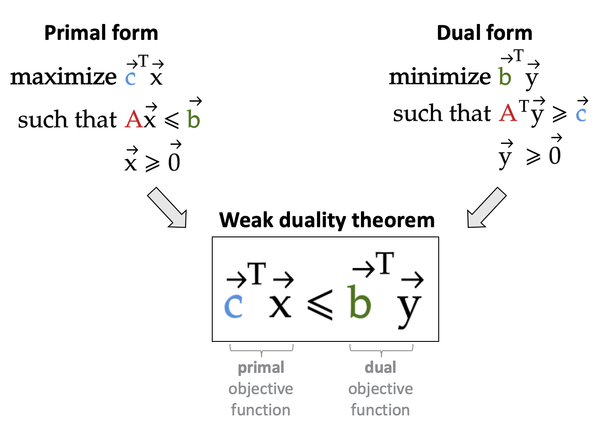

# Duality theorems and their proofs

Optimization shows up everywhere in machine learning, from the ubiquitous [gradient descent](https://en.wikipedia.org/wiki/Gradient_descent), to [quadratic programming](https://www.projectrhea.org/rhea/index.php/Lecture_12_-_Support_Vector_Machine_and_Quadratic_Optimization_Problem_OldKiwi) in SVM, to [expectation-maximization algorithm](http://cs229.stanford.edu/notes/cs229-notes8.pdf) in Gaussian mixture models. 
However, one aspect of optimization that always puzzled me is duality: what on earth is a primal form and dual form of an optimization problem, and what good do they really serve?

## Project structure
* **Part 1:** Weak duality theorem ([code](src/part1.ipynb), [write-up](https://medium.com/@seismatica/duality-theorems-and-their-proofs-400286957bc5?source=friends_link&sk=31ff1a32e91b5e75cb7d74825d8af685))

* **Part 2:** Strong duality theorem (coming soon)